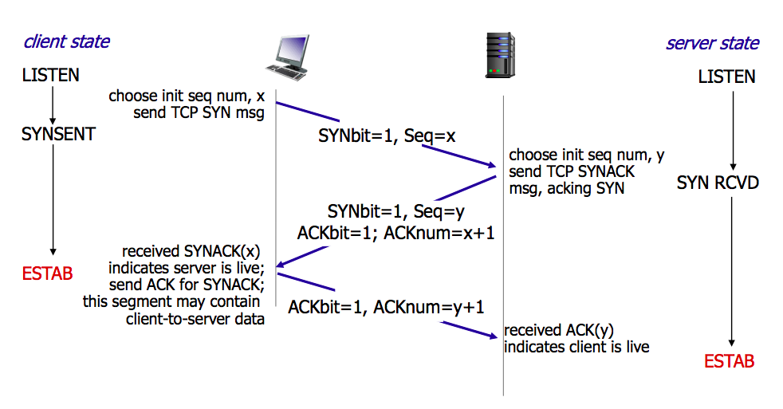

## Http

HTTP是超文本传输协议，实现点对点的超文本传输。
HTTP 协议构建于 TCP/IP 协议之上，是一个应用层协议，默认端口号是 80
HTTP 是无连接无状态的

### Http方法

* get
* put
* post
* delete
* head
* option   跨域预检请求

### Http状态码

* 1xx：握手中间状态码
* 2xx：成功
* 3xx：重定向
* 4xx：客户端请求错误
* 5xx：服务器错误

### [Http缓存](./http-cache.md)

### 会话跟踪

**什么是会话？**

客户端打开与服务器的连接发出请求到服务器响应客户端请求的全过程称之为会话。

**什么是会话跟踪？**

会话跟踪指的是对同一个用户对服务器的连续的请求和接受响应的监视。

**为什么需要会话跟踪？**

浏览器与服务器之间的通信是通过HTTP协议进行通信的，而HTTP协议是”无状态”的协议，它不能保存客户的信息，即一次响应完成之后连接就断开了，下一次的请求需要重新连接，这样就需要判断是否是同一个用户，所以才有会话跟踪技术来实现这种要求。

**会话跟踪常用的方法:**

*URL 重写*

URL(统一资源定位符)是Web上特定页面的地址，URL重写的技术就是在URL结尾添加一个附加数据以标识该会话,把会话ID通过URL的信息传递过去，以便在服务器端进行识别不同的用户。

*隐藏表单域*

将会话ID添加到HTML表单元素中提交到服务器，此表单元素并不在客户端显示

*Cookie*

Cookie 是Web 服务器发送给客户端的一小段信息，客户端请求时可以读取该信息发送到服务器端，进而进行用户的识别。对于客户端的每次请求，服务器都会将 Cookie 发送到客户端,在客户端可以进行保存,以便下次使用。

客户端可以采用两种方式来保存这个 Cookie 对象，一种方式是保存在客户端内存中，称为临时 Cookie，浏览器关闭后这个 Cookie 对象将消失。另外一种方式是保存在客户机的磁盘上，称为永久 Cookie。以后客户端只要访问该网站，就会将这个 Cookie 再次发送到服务器上，前提是这个 Cookie 在有效期内，这样就实现了对客户的跟踪。

Cookie 是可以被客户端禁用的。

*Session:*

每一个用户都有一个不同的 session，各个用户之间是不能共享的，是每个用户所独享的，在 session 中可以存放信息。

在服务器端会创建一个 session 对象，产生一个 sessionID 来标识这个 session 对象，然后将这个 sessionID 放入到 Cookie 中发送到客户端，下一次访问时，sessionID 会发送到服务器，在服务器端进行识别不同的用户。

Session 的实现依赖于 Cookie，如果 Cookie 被禁用，那么 session 也将失效。

## TCP

* TCP 提供一种面向连接的、可靠的字节流服务
* 在一个 TCP 连接中，仅有两方进行彼此通信。广播和多播不能用于 TCP
* TCP 使用校验和，确认和重传机制来保证可靠传输
* TCP 给数据分节进行排序，并使用累积确认保证数据的顺序不变和非重复
* TCP 使用滑动窗口机制来实现流量控制，通过动态改变窗口的大小进行拥塞控制

### 三次握手

所谓三次握手(Three-way Handshake)，是指建立一个 TCP 连接时，需要客户端和服务器总共发送3个包。

三次握手的目的是连接服务器指定端口，建立 TCP 连接，并同步连接双方的序列号和确认号，交换 TCP 窗口大小信息。在 socket 编程中，客户端执行 connect() 时。将触发三次握手。

* 第一次握手(SYN=1, seq=x):

客户端发送一个 TCP 的 SYN 标志位置1的包，指明客户端打算连接的服务器的端口，以及初始序号 X,保存在包头的序列号(Sequence Number)字段里。

发送完毕后，客户端进入 SYN_SEND 状态。

* 第二次握手(SYN=1, ACK=1, seq=y, ACKnum=x+1):

服务器发回确认包(ACK)应答。即 SYN 标志位和 ACK 标志位均为1。服务器端选择自己 ISN 序列号，放到 Seq 域里，同时将确认序号(Acknowledgement Number)设置为客户的 ISN 加1，即X+1。 发送完毕后，服务器端进入 SYN_RCVD 状态。

* 第三次握手(ACK=1，ACKnum=y+1)

客户端再次发送确认包(ACK)，SYN 标志位为0，ACK 标志位为1，并且把服务器发来 ACK 的序号字段+1，放在确定字段中发送给对方，并且在数据段放写ISN的+1

发送完毕后，客户端进入 ESTABLISHED 状态，当服务器端接收到这个包时，也进入 ESTABLISHED 状态，TCP 握手结束。

三次握手的过程的示意图如下：

### 四次挥手

TCP 的连接的拆除需要发送四个包，因此称为四次挥手(Four-way handshake)，也叫做改进的三次握手。客户端或服务器均可主动发起挥手动作，在 socket 编程中，任何一方执行 close() 操作即可产生挥手操作。

* 第一次挥手(FIN=1，seq=x)

假设客户端想要关闭连接，客户端发送一个 FIN 标志位置为1的包，表示自己已经没有数据可以发送了，但是仍然可以接受数据。

发送完毕后，客户端进入 FIN_WAIT_1 状态。

* 第二次挥手(ACK=1，ACKnum=x+1)

服务器端确认客户端的 FIN 包，发送一个确认包，表明自己接受到了客户端关闭连接的请求，但还没有准备好关闭连接。

发送完毕后，服务器端进入 CLOSE_WAIT 状态，客户端接收到这个确认包之后，进入 FIN_WAIT_2 状态，等待服务器端关闭连接。

* 第三次挥手(FIN=1，seq=y)

服务器端准备好关闭连接时，向客户端发送结束连接请求，FIN 置为1。

发送完毕后，服务器端进入 LAST_ACK 状态，等待来自客户端的最后一个ACK。

* 第四次挥手(ACK=1，ACKnum=y+1)

客户端接收到来自服务器端的关闭请求，发送一个确认包，并进入 TIME_WAIT状态，等待可能出现的要求重传的 ACK 包。

服务器端接收到这个确认包之后，关闭连接，进入 CLOSED 状态。

客户端等待了某个固定时间（两个最大段生命周期，2MSL，2 Maximum Segment Lifetime）之后，没有收到服务器端的 ACK ，认为服务器端已经正常关闭连接，于是自己也关闭连接，进入 CLOSED 状态。

**四次挥手的示意图如下：**

## Https

Https是在http基础上，在应用层和传输层加入SSL，实现数据的加密传输

### 加密原理

RSA非对称加密采用公钥和私钥对，公钥公开，私钥自己保密

**加密时**公钥加密，私钥解密

**签名时**私钥加密，公钥解密验证

https一般流程是服务器生成公钥私钥对，发送crt文件（包含公钥和主题信息，比如网站所有者、域名、地区等）到CA机构申请证书，CA机构对该文件内容做hash计算，基于hash值用CA机构的私钥加密签名，基于crt文件和签名信息生成证书颁发给申请者。

### Https四次握手

* 客户端发送一个 ClientHello 消息到服务器端，消息中同时包含了它的 Transport Layer Security (TLS) 版本，可用的加密算法和压缩算法。
* 服务器端向客户端返回一个 ServerHello 消息，消息中包含了服务器端的 TLS 版本，服务器所选择的加密和压缩算法，以及数字证书认证机构（Certificate Authority，缩写 CA）签发的服务器公开证书，证书中包含了公钥。客户端会使用这个公钥加密接下来的握手过程，直到协商生成一个新的对称密钥。证书中还包含了该证书所应用的域名范围（Common Name，简称 CN），用于客户端验证身份。
* 客户端根据自己的信任 CA 列表，验证服务器端的证书是否可信。如果认为可信（具体的验证过程在下一节讲解），客户端会生成一串伪随机数，使用服务器的公钥加密它。这串随机数会被用于生成新的对称密钥
* 服务器端使用自己的私钥解密上面提到的随机数，然后使用这串随机数生成自己的对称主密钥
* 客户端发送一个 Finished 消息给服务器端，使用对称密钥加密这次通讯的一个散列值
* 服务器端生成自己的 hash 值，然后解密客户端发送来的信息，检查这两个值是否对应。如果对应，就向客户端发送一个 Finished 消息，也使用协商好的对称密钥加密
从现在开始，接下来整个 TLS 会话都使用对称秘钥进行加密，传输应用层（HTTP）内容

## CDN

[🔗 阿里云CDN原理](https://developer.aliyun.com/article/749176)

## 参考

[https://hit-alibaba.github.io/interview/basic/network/HTTP.html](https://hit-alibaba.github.io/interview/basic/network/HTTP.html)