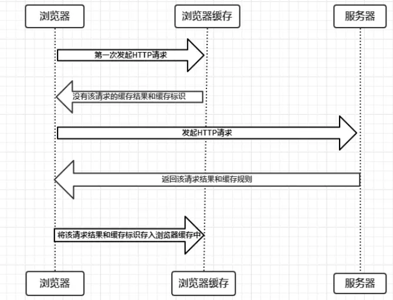

# 浏览器缓存

[toc]

浏览器缓存实现加载性能优化、节约带宽资源、减轻服务器压力.

### 强缓存

浏览器缓存优先使用内存缓存（memory cache）其次使用硬盘缓存（disk cache）

实现强缓存主要两种 HTTP Header 实现：Expires & CacheControl

1. Expires 是http1.0产物，告诉浏览器该请求资源有效时间；使用本地时间对比，修改本地时间就导致失效

2. CacheControl是http1.1产物，优先级高于Expires，有多种缓存策略可使用，如下图


Pragma也是1.0产物，它用来向后兼容只支持 HTTP/1.0 协议的缓存服务器

```javascript
Pragma: no-cache
```


### 协商缓存

协商缓存可以通过设置两种 HTTP Header 实现：Last-Modified 和 ETag 。

协商缓存判断资源未更新，则放回304空响应，继续使用本地缓存

1. （弱校验器）Last-Modified和If-Modified-Since

2. （强校验器）ETag和If-None-Match，ETag优先级高于last-modify





### 常用配置

| 规则 | 消息包头 |	值/示例 |  类型 | 作用 |
| :--- | :--- | :--- | :--- | :--- |
| 新鲜度 |	Pragma |	no-cache | 响应 | 告诉浏览器忽略资源的缓存副本，每次访问都需要去服务器拉取【http1.0中存在的字段，在http1.1已被抛弃，使用Cache-Control替代，但为了做http协议的向下兼容，很多网站依旧会带上这个字段】|
| | Expires	| Mon, 15 Aug 2016 03:56:47 GMT	| 响应	|启用缓存和定义缓存时间。告诉浏览器资源缓存过期时间，如果还没过该时间点则不发请求【http1.0中存在的字段，该字段所定义的缓存时间是相对服务器上的时间而言的，如果客户端上的时间跟服务器上的时间不一致（特别是用户修改了自己电脑的系统时间），那缓存时间可能就没啥意义了。在HTTP 1.1版开始，使用Cache-Control: max-age=秒替代】|
| | Cache-Control	| no-cache 	| 响应	|告诉浏览器忽略资源的缓存副本，强制每次请求直接发送给服务器，拉取资源，但不是“不缓存”|
| | | no-store |	响应	| 强制缓存在任何情况下都不要保留任何副本|
| | | max-age=[秒] |	响应 |	指明缓存副本的有效时长，从请求时间开始到过期时间之间的秒数|
| | | public |	响应 |	任何路径的缓存者（本地缓存、代理服务器），可以无条件的缓存改资源|
| | | private |	响应 | 只针对单个用户或者实体（不同用户、窗口）缓存资源|
| 校验时间 | Last-Modified |	Mon, 15 Aug 2016 03:56:47 GMT |	响应 |	告诉浏览器这个资源最后的修改时间。服务器将资源传递给客户端时，会将资源最后更改的时间以“Last-Modified: GMT”的形式加在实体首部上一起返回给客户端【只能精确到秒级，如果某些文件在1秒钟以内，被修改多次的话，它将不能准确标注文件的修改时间】|
| | If-Modified-Since | Mon, 15 Aug 2016 03:56:47 GMT | 请求 | 	其值为上次响应头的Last-Modified值，再次向web服务器请求时带上头If-Modified-Since。web服务器收到请求后发现有头If-Modified-Since则与被请求资源的最后修改时间进行比对。若最后修改时间较新，说明资源又被改动过，则响应整片资源内容（写在响应消息包体内），包括更新Last-Modified的值，HTTP 200；若最后修改时间较旧，说明资源无新修改，则响应HTTP 304(无需包体，节省流量)，告知浏览器继续使用所保存的cache|
| 校验值 | ETag | "fd56273325a2114818df4f29a628226d" |	响应 |	告诉浏览器当前资源在服务器的唯一标识符（生成规则又服务器决定）|
| | If-None-Match |	 "fd56273325a2114818df4f29a628226d"	| 请求 |	当资源过期时（使用Cache-Control标识的max-age），发现资源具有Etage声明，则再次向web服务器请求时带上头If-None-Match（Etag的值）。web服务器收到请求后发现有头If-None-Match则与被请求资源的相应校验串进行比对，决定返回200或304


### 用户行为与缓存

浏览器缓存行为还有用户的行为有关，具体情况如下：

用户操作 |	Expires/Cache-Control |	Last-Modified/Etag
---|---|---|
地址栏回车 | 有效 |	有效
页面链接跳转 |	有效 |	有效
新开窗口 |	有效 |	有效
前进、后退	| 有效 | 有效
F5刷新 |	无效(BR重置max-age=0) | 	有效
Ctrl+F5刷新	| 无效（重置Cache-Control=no-cache）| 无效（请求头丢弃该选项


### 不能缓存的请求

1. HTTP信息头中包含Cache-Control:no-cache，pragma:no-cache（HTTP1.0），或Cache-Control:max-age=0等告诉浏览器不用缓存的请求

2. 需要根据Cookie，认证信息等决定输入内容的动态请求是不能被缓存的

3. 经过HTTPS安全加密的请求（有人也经过测试发现，ie其实在头部加入Cache-Control：max-age信息，firefox在头部加入Cache-Control:Public之后，能够对HTTPS的资源进行缓存，参考[《HTTPS的七个误解》](http://www.ruanyifeng.com/blog/2011/02/seven_myths_about_https.html)）

4. POST请求无法被缓存

5. HTTP响应头中不包含Last-Modified/Etag，也不包含Cache-Control/Expires的请求无法被缓存
